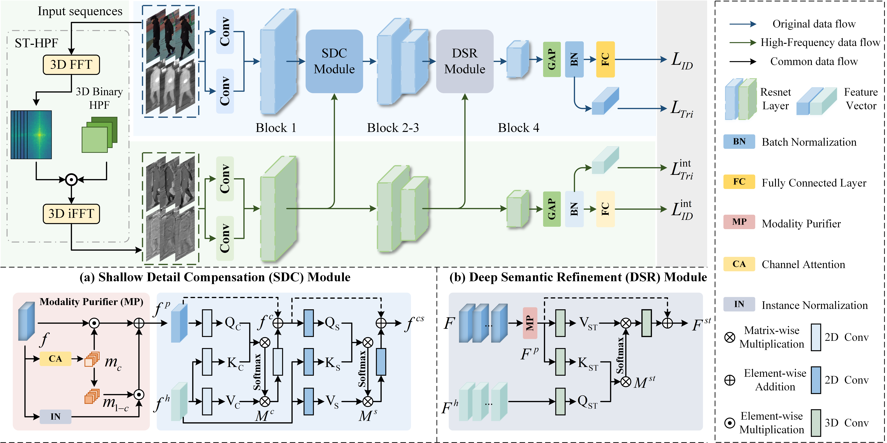

# Spatial-Temporal High-Frequency Learning for Video-based Visible-Infrared Person Re-Identification
[Paper](https://ieeexplore.ieee.org/document/11421899)

## Pipeline



## Requirements

### Installation

We use /torch >=1.8 / 48G  RTX8000 for training and evaluation.

### Prepare Datasets
code (**Make_Data.py**) for Datasets HITSZ-VCM to generate intermediate modality at sequence level.

code (**Make_Data_Bu.py**) for Datasets BUPTCampus to generate intermediate modality at sequence level.

Note that the organization, file name, and storage format of the original data and the intermediate modality data should be consistent.

## Training and Evaluation

```shell
python train.py
```

Later, we will upload our trained model([link](https://pan.quark.cn/s/c88d4287c099)), and you can load the model directly without training.

## Cite
```
@ARTICLE{11421899,
  author={Tao, Sichen and Li, Shuang and Ye, Jun and Dong, Neng and Li, Fan and Li, Huafeng},
  journal={IEEE Transactions on Circuits and Systems for Video Technology}, 
  title={Spatial-Temporal High-Frequency Learning for Video-based Visible-Infrared Person Re-Identification}, 
  year={2026},
  volume={},
  number={},
  pages={1-1},
  keywords={Videos;Semantics;Feature extraction;Pedestrians;Identification of persons;Fast Fourier transforms;Circuits and systems;Information filters;Frequency-domain analysis;Video sequences;Video-Based Visible-Infrared Person Re-Identification;Spatial-Temporal High-Frequency Information;Sequence-Level Intermediate Modality},
  doi={10.1109/TCSVT.2026.3670874}}
```
